# RecipeHub

RecipeHub — веб-приложение на Symfony для регистрации пользователей, создания рецептов и отзывов. Проект упакован в контейнеры через Docker Compose. Дополнительно подготовлен вариант запуска в Minikube через Kubernetes-манифесты.

Для базы данных используется PostgreSQL, для централизованного хранения логов — Loki, для просмотра логов — Grafana.

## Контейнеры / сервисы

```text
app       - Symfony-приложение на FrankenPHP
postgres  - база данных PostgreSQL
loki      - централизованное хранилище логов
promtail  - сборщик файловых логов приложения
grafana   - просмотр логов из Loki
```

Схема сбора логов:

```text
Symfony Monolog -> /var/log/recipehub/*.log -> Promtail -> Loki -> Grafana
```

Собираются именно **логи приложения**, не метрики.

## Запуск через Docker Compose

Собрать образ с тегом:

```bash
./scripts/build.sh -t v1
```

Запустить контейнеры с этим тегом:

```bash
./scripts/deploy.sh -t v1
```

Остановить контейнеры:

```bash
./scripts/down.sh
```

Адреса:

```text
Приложение: http://localhost:8080
Grafana:    http://localhost:3000
```

Данные для входа в Grafana:

```text
login:    admin
password: admin
```

## Запуск через Minikube

Kubernetes namespace:

```text
trofimov20260527
```

Запустить Minikube:

```bash
minikube start --driver=docker --cpus=4 --memory=4096
minikube status
```

Собрать образ и загрузить его в Minikube:

```bash
./scripts/k8s-build.sh -t v1
```

Развернуть manifests:

```bash
./scripts/k8s-deploy.sh -t v1
```

Проверить namespace, pods и services:

```bash
kubectl get namespaces
kubectl get pods -n trofimov20260527
kubectl get svc -n trofimov20260527
```

Открыть приложение:

```bash
kubectl -n trofimov20260527 port-forward svc/recipehub-app 8080:8080
```

Открыть Grafana в отдельном терминале:

```bash
kubectl -n trofimov20260527 port-forward svc/grafana 3000:3000
```

Остановить Kubernetes-стенд:

```bash
./scripts/k8s-down.sh
```

В Minikube Promtail запущен как sidecar-контейнер в Pod приложения и читает application logs из `/var/log/recipehub/*.log`.

## Проверка логов

1. Открыть приложение: `http://localhost:8080`.
2. Зарегистрировать пользователя или войти в аккаунт.
3. Создать рецепт или отзыв.
4. Открыть Grafana: `http://localhost:3000`.
5. Перейти в **Explore**.
6. Выбрать datasource **Loki**.
7. Выполнить запрос:

```logql
{app="recipehub"}
```

Примеры логируемых событий:

```text
User registered successfully
Login attempt
Login successful
Recipe created
Review created
Profanity detected
```

## Скриншоты Docker Compose

### Рабочее приложение

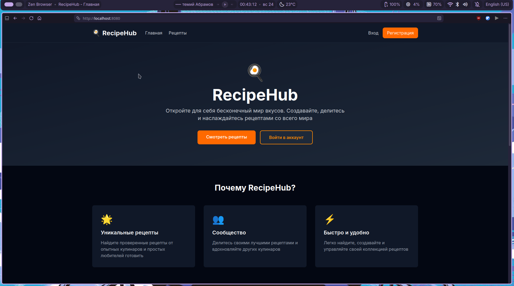

### Запущенные контейнеры Docker Compose

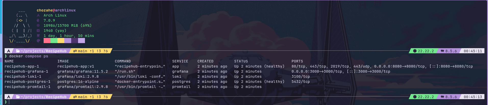

### Grafana

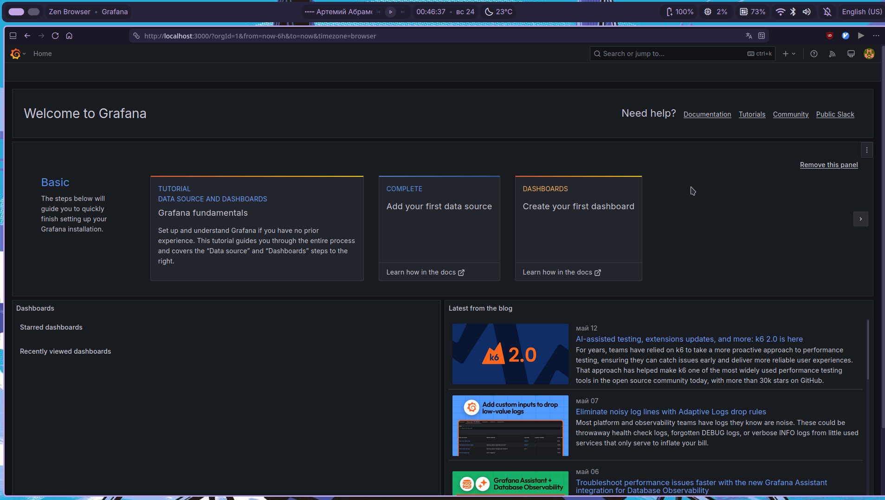

### Loki datasource в Grafana

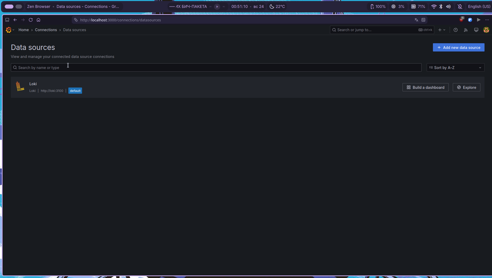

### Логи приложения в Grafana Explore

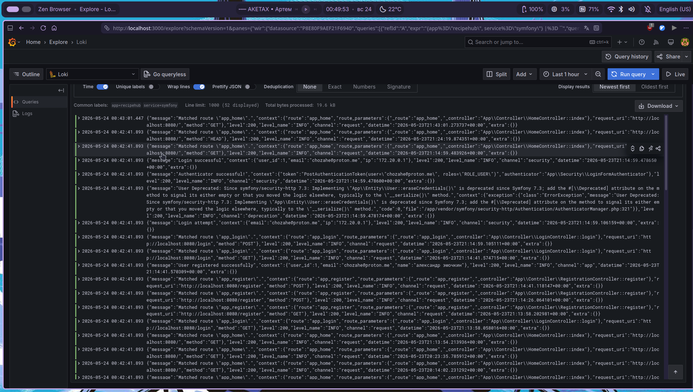

### Детали записи лога с labels

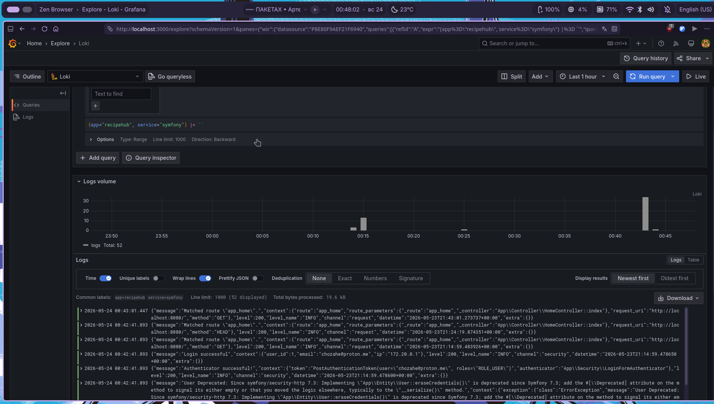

## Скриншоты Minikube

### Namespace

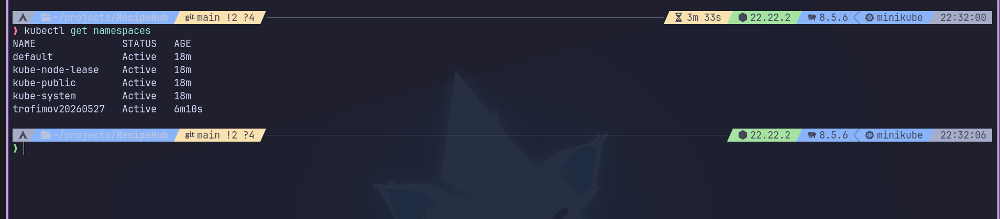

### Pods

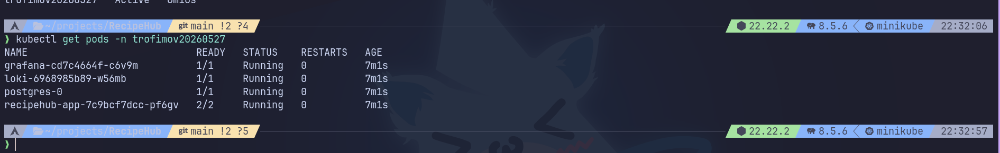

### Services

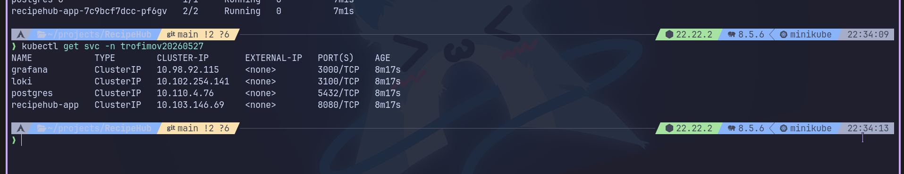

### Приложение через Minikube port-forward

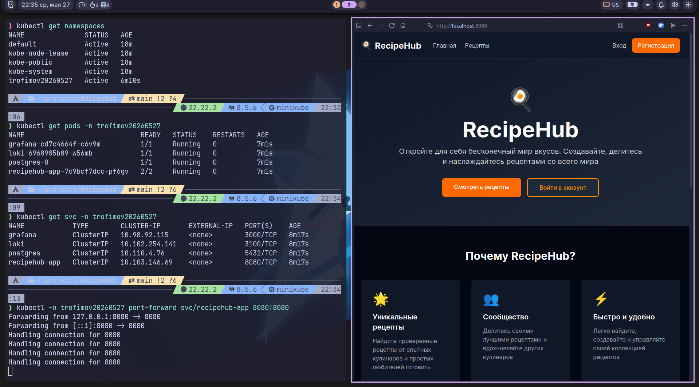

### Логи в Grafana через Minikube

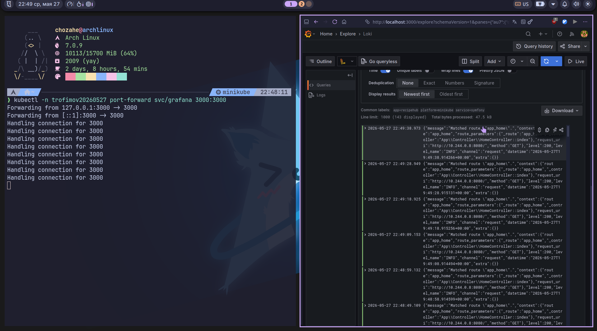

## Полезные команды

Посмотреть контейнеры Docker Compose:

```bash
docker compose ps
```

Посмотреть логи приложения:

```bash
docker compose logs app
```

Проверить, что Promtail читает файлы логов:

```bash
docker compose logs promtail
```

Проверить labels в Loki:

```bash
docker compose exec loki wget -qO- 'http://localhost:3100/loki/api/v1/labels'
```
